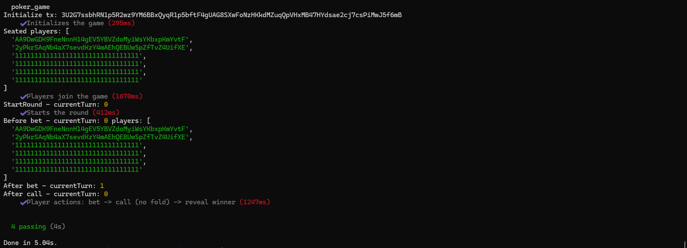

---

# ♠️ Poker Game on Solana

A multiplayer poker game implemented as a Solana smart contract using [Anchor](https://www.anchor-lang.com/). This project showcases how to build decentralized game logic on-chain with Rust and Anchor.

---

## 🎮 Game Features

- 🔧 Initialize a new poker game with customizable **small blind** and **big blind** values  
- 👥 Allow players to **join the game** by depositing SOL  
- 🃏 **Start rounds** and deal hole cards + community cards  
- 💰 Enable player actions: **bet**, **call**, and **fold**  
- 🏆 Reveal the **winner** and distribute the pot  
- 🔄 **End the game** and reset the state for a fresh start  

---

## 🖼️ Test Output Screenshot



This image captures a successful test sequence:
- Game initialized  
- Players joined  
- Round started  
- Player actions executed (bet → call)  
- Winner determined and pot distributed  

---

## 📁 Project Structure

| Path | Description |
|------|-------------|
| `programs/poker_game` | On-chain Rust smart contract |
| `tests/poker_game.ts` | Anchor integration tests |
| `tests/poker_game.png` | Screenshot of test output |
| `app/` | Optional frontend (if implemented) |
| `migrations/` | Deployment scripts |
| `Anchor.toml` | Anchor configuration |
| `Cargo.toml` | Rust dependencies |
| `package.json` | Node.js dependencies |

---

## ⚙️ Installation & Usage

### 1. Clone the repository
```bash
git clone git@github.com:yourusername/poker_game.git
cd poker_game
```

### 2. Install Node dependencies
```bash
yarn install
```

### 3. Build the Solana program
```bash
anchor build
```

### 4. Run tests on a local validator
```bash
anchor test
```

The test suite in `tests/poker_game.ts` simulates full gameplay: game setup, player actions, and round resolution.

---

## 📦 Requirements

- [Rust](https://www.rust-lang.org/tools/install)  
- [Anchor](https://www.anchor-lang.com/docs/installation)  
- [Node.js](https://nodejs.org/)  
- [Solana CLI](https://docs.solana.com/cli/install-solana-cli-tools)  

---

## 📄 License

This project is licensed under the **MIT License**.

---
